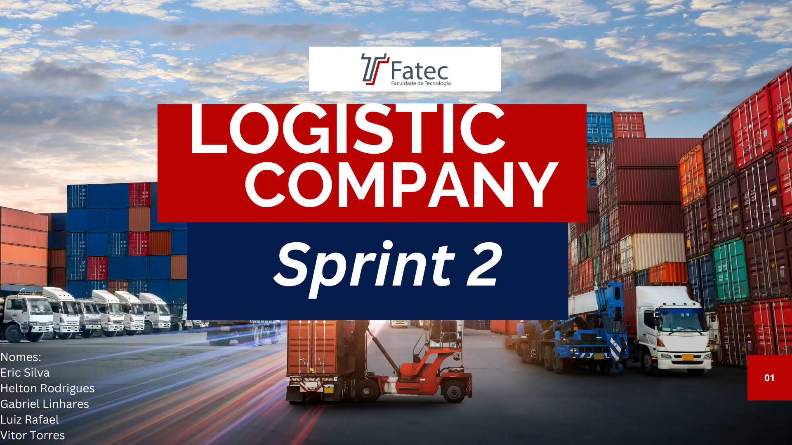
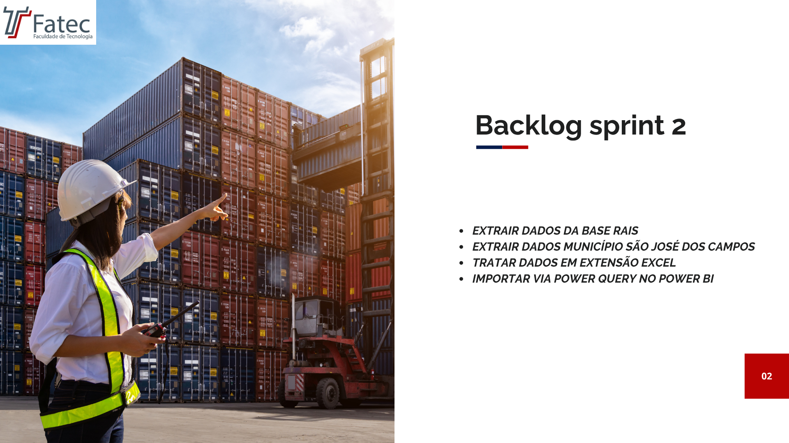
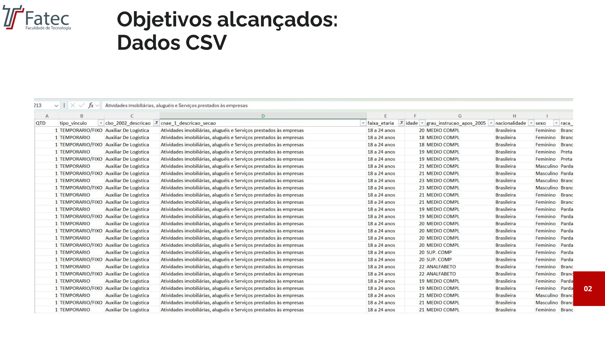
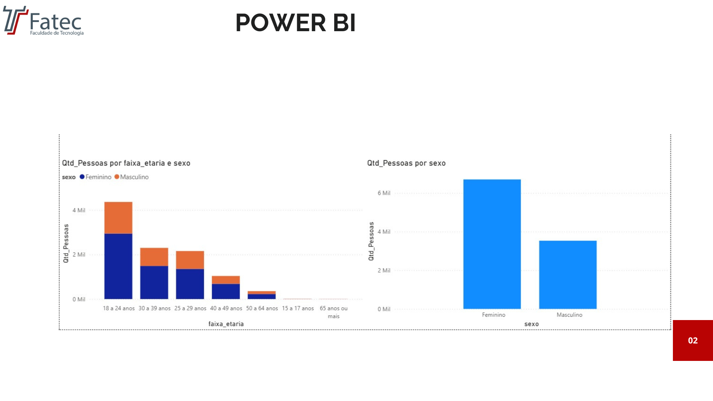
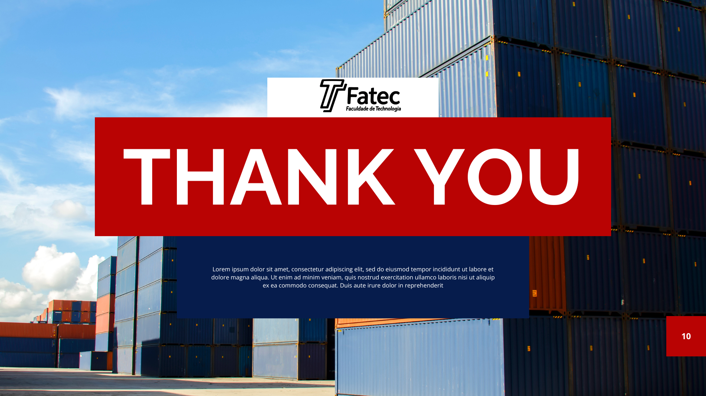

# Introdução ao trabalho LOGISTIC COMPANY (sprint 2)
</img>
# Apresentação BACKLOG (sprint 2)
</img>
# Sistema visual dos dados (Excel)
</img>
</img>
# O projeto encontra-se finalizado e disponível para análise. Gostaria de comunicar a conclusão do projeto Logistic Company
</img>
